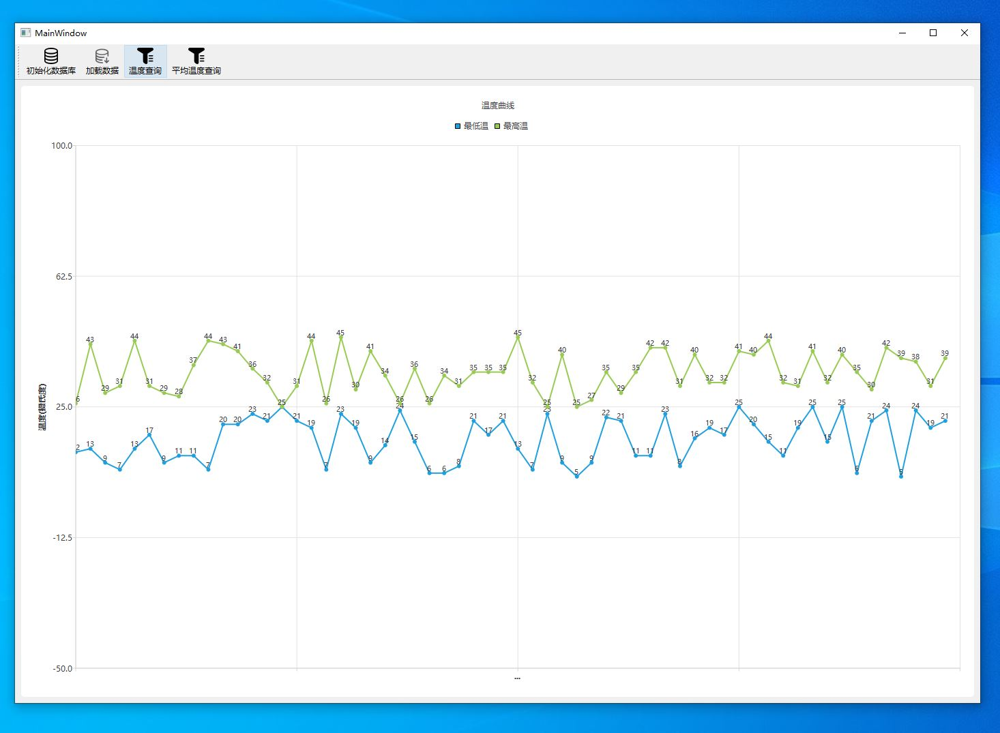

# QtTemp
# 一、项目需求

## 1、使用Qt实现将2019年~2022年3年气温数据（每分钟最高和最低温度）生成并插入到SQLite库中（百万级记录）

## 2、用Qt做为界面，结合画图库，实现任选时间段内气温曲线绘制

## 3、3秒内完成查询3年内月最高和最低气温平均值并绘制成曲线；

需求解析：为了实现高效插入数据：我们使用文件批量插入、并且在插入时候使用exebatch()，以及使用事务减少IO操作。本项目性能难点在于Qt的图形绘制，图形绘制在数据多时候非常困难，需要用到多线程等技术。

​		  为了实现高效查找，需要指定索引，使用主键索引实现高效查找。数据表结构如下：

```
CREATE TABLE TEMP (
    DISTRICT   TEXT    NOT NULL,
    RECODEDATE INTEGER NOT NULL,
    MINTEMP    INT     NOT NULL,
    MAXTEMP    INT     NOT NULL,
    PRIMARY KEY (
        DISTRICT,
        RECODEDATE
    )
); //将地区和时间戳作为复合主键，因为同个地区，同一分钟不会有两条记录
```



# 二、项目介绍

该项目已经提前使用代码生成100万条深圳（SZ）地区每一分钟的温度记录在resource文件夹一个TXT文件中。并且创建了一个名为data的SQlite数据库，但是还没建表。程序启动需要先初始化数据库，然后读取数据。再可以进行绘图操作
